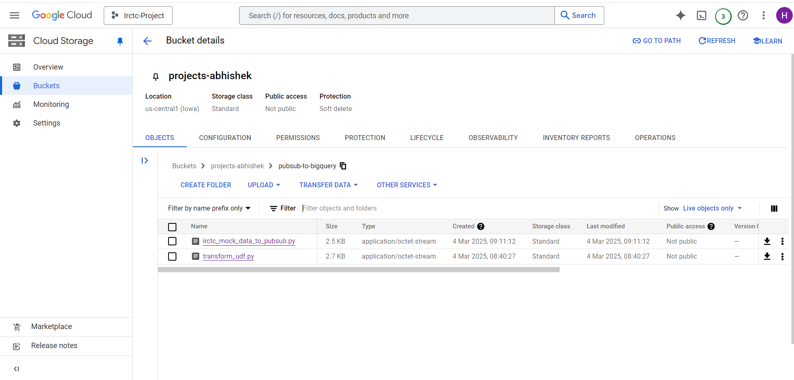
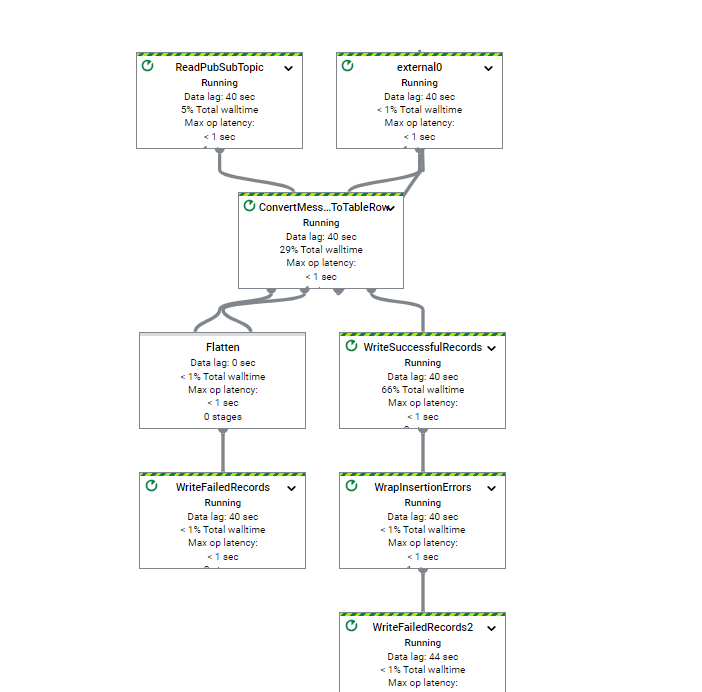

# GCP_Data_Engineering_projects
This repository will contain all my personal projects for GCP - Data Engineering

C:\Users\arawa\AppData\Local\Google\Cloud SDK>gcloud auth login

C:\Users\arawa\AppData\Local\Google\Cloud SDK>cd C:\Users\arawa\Downloads\Irctc-PubSub-Stream-To-BigQuery-Project\Irctc-PubSub-Stream-To-BigQuery-Project

C:\Users\arawa\Downloads\Irctc-PubSub-Stream-To-BigQuery-Project\Irctc-PubSub-Stream-To-BigQuery-Project>gcloud auth application-default login

C:\Users\arawa\Downloads\Irctc-PubSub-Stream-To-BigQuery-Project\Irctc-PubSub-Stream-To-BigQuery-Project>python irctc_mock_data_to_pubsub.py

### Set the IAM Role :

### Create a BigqueryTable:

### Put your code in Cloud Storage:

### Create a Dataflow using Template:

